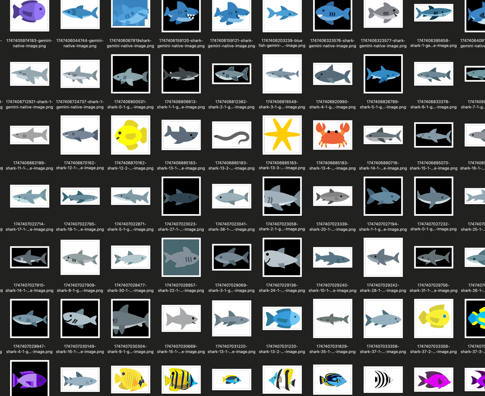

# Fish Generator

An experimental project for generating game icons of sea creatures that match an existing art style. This tool helps non-artists create consistent art assets by generating new sea creatures based on a set of example fish images.



## Purpose

This project aims to solve a common challenge in game development: maintaining visual consistency when expanding an art collection. By learning from an existing set of fish images, the generator can create new sea creatures that match the same style, allowing developers without artistic skills to expand their game's asset library.

## Example Usage

The current implementation uses a set of fish icons in various colors as reference material to generate new sea creatures that maintain the same artistic style.

## Getting Started

```bash
# Install dependencies
npm install

# Authenticate with Google Cloud
gcloud auth application-default login

# Set environment variables
export GOOGLE_CLOUD_PROJECT="your-project-id"
export GOOGLE_CLOUD_LOCATION=global
export GOOGLE_GENAI_USE_VERTEXAI=True
export FISH_COUNT=30 # Number of images to generate
export FISH_TYPE="seahorse" # Or any other sea creature you want to generate

# Run the generator
npm start
```

## Project Structure

- `images/` - Contains the reference fish images in different colors
- `output/` - Generated sea creature images will be saved here
- `src/` - Source code for the generator

## Prerequisites

- Node.js (v14+)
- A Google Cloud account with the Vertex AI API enabled
- The Google Cloud CLI (gcloud) installed
